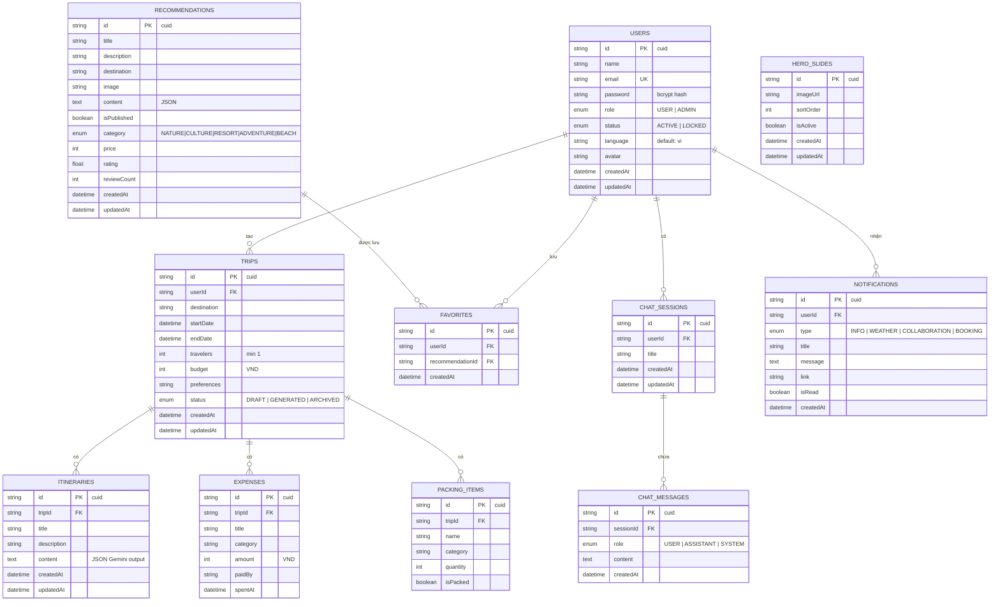
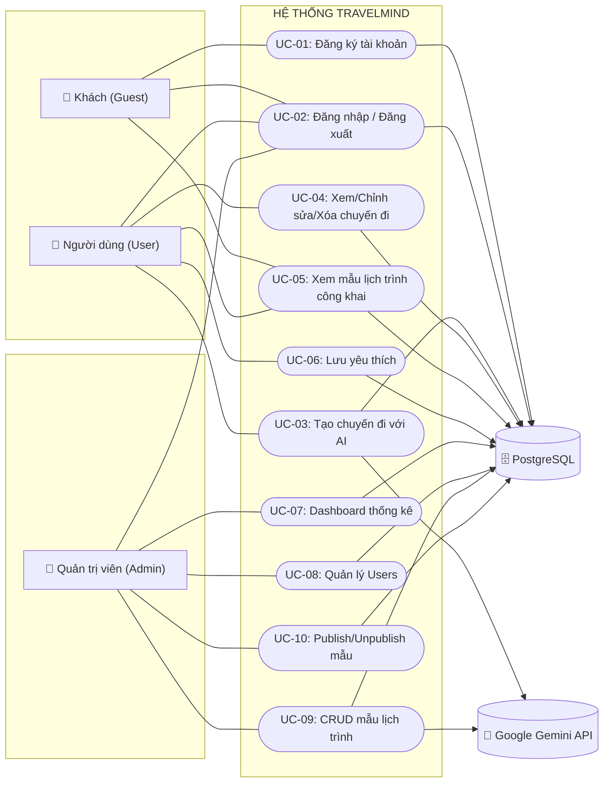
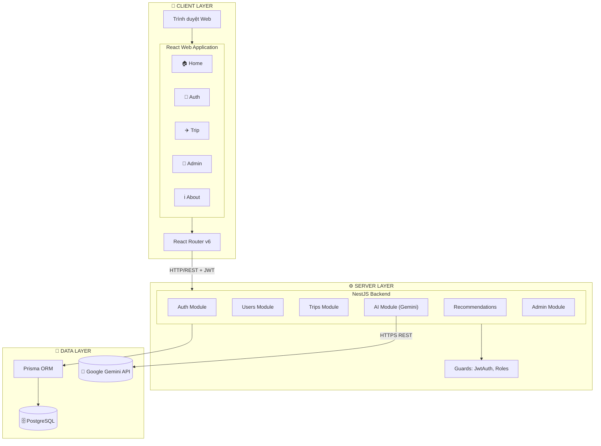
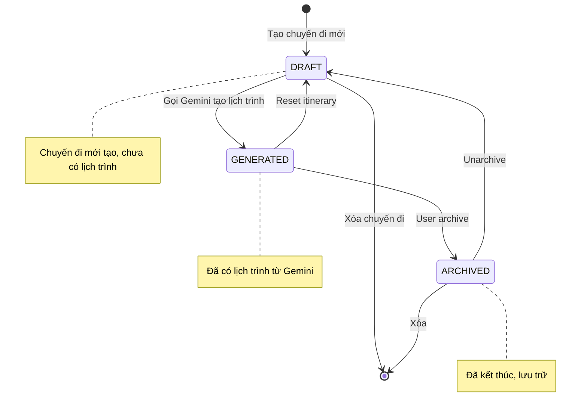
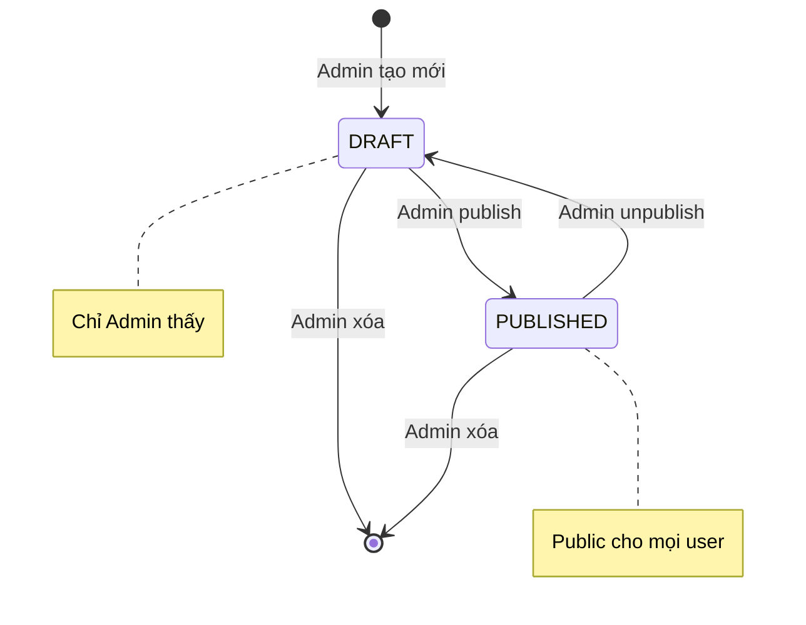

# TÀI LIỆU ĐẶC TẢ YÊU CẦU PHẦN MỀM (SRS)

## Software Requirements Specification

---

| Thông tin | Chi tiết |
|-----------|----------|
| **Tên dự án** | TravelMind - Hệ thống lập kế hoạch du lịch thông minh với AI |
| **Mã tài liệu** | SRS-TRAVELMIND-v1.0 |
| **Phiên bản** | 1.0 |
| **Ngày tạo** | 25/08/2026 |
| **Người tạo** | Nhóm phát triển TravelMind |
| **Trạng thái** | Đang phát triển |
| **Chuẩn tham chiếu** | IEEE Std 830-1998 |

---

## MỤC LỤC

1. [Giới thiệu](#1-giới-thiệu)
   - 1.1. Mục đích
   - 1.2. Phạm vi
   - 1.3. Định nghĩa, viết tắt, từ viết tắt
   - 1.4. Tài liệu tham chiếu
   - 1.5. Tổng quan tài liệu
2. [Mô tả tổng quan](#2-mô-tả-tổng-quan)
   - 2.1. Bối cảnh sản phẩm
   - 2.2. Các chức năng của sản phẩm
   - 2.3. Đặc điểm người dùng
   - 2.4. Ràng buộc
   - 2.5. Giả định và phụ thuộc
3. [Yêu cầu chức năng cụ thể](#3-yêu-cầu-chức-năng-cụ-thể)
   - 3.1. Use-case tổng quát
   - 3.2. Use-case User
   - 3.3. Use-case Admin
   - 3.4. Đặc tả chi tiết từng Use-case
4. [Yêu cầu giao diện bên ngoài](#4-yêu-cầu-giao-diện-bên-ngoài)
   - 4.1. Giao diện người dùng
   - 4.2. Giao diện phần mềm
   - 4.3. Giao diện truyền thông
5. [Yêu cầu phi chức năng](#5-yêu-cầu-phi-chức-năng)
6. [Các ràng buộc thiết kế khác](#6-các-ràng-buộc-thiết-kế-khác)
7. [Phụ lục](#7-phụ-lục)
   - 7.1. Mô hình dữ liệu (ERD)
   - 7.2. Cấu trúc API REST
   - 7.3. Sơ đồ kiến trúc

---

# 1. GIỚI THIỆU

## 1.1. Mục đích

Tài liệu này đặc tả đầy đủ các yêu cầu phần mềm cho hệ thống **TravelMind** - một ứng dụng web lập kế hoạch du lịch thông minh có tích hợp AI. Tài liệu SRS này phục vụ cho:

- **Nhóm phát triển**: Làm cơ sở để thiết kế, xây dựng và kiểm thử hệ thống.
- **Giảng viên hướng dẫn / Hội đồng bảo vệ**: Đánh giá tính đầy đủ và khả thi của đề tài.
- **Các bên liên quan khác**: Tham chiếu chung về phạm vi và ràng buộc của dự án.

Tài liệu được viết theo chuẩn **IEEE Std 830-1998** với mức độ chi tiết phù hợp cho một đồ án tốt nghiệp đại học ngành Công nghệ thông tin.

## 1.2. Phạm vi

### 1.2.1. Phạm vi được thực hiện (Phase 1 - MVP)

| STT | Phạm vi | Mô tả |
|-----|---------|--------|
| 1 | Xác thực & phân quyền | Đăng ký, đăng nhập với JWT, phân quyền USER/ADMIN |
| 2 | Lập kế hoạch với AI | Tạo lịch trình chi tiết theo điểm đến, ngày, ngân sách, sở thích |
| 3 | Quản lý chuyến đi | CRUD chuyến đi, lưu nhiều lịch trình |
| 4 | Mẫu lịch trình công khai | Admin CRUD và Publish/Unpublish mẫu |
| 5 | Yêu thích | User lưu các mẫu lịch trình yêu thích |
| 6 | Quản trị | Dashboard thống kê, quản lý users, quản lý nội dung |
| 7 | Giao diện responsive | Mobile-first, đa nền tảng |

### 1.2.2. Ngoài phạm vi (Phase 2+)

| STT | Tính năng | Lý do đưa ra Phase 2+ |
|-----|-----------|------------------------|
| 1 | Thanh toán trực tuyến (Stripe/VNPay) | Cần tích hợp đối tác thực tế |
| 2 | Bản đồ Google Maps với API key | Yêu cầu tài khoản Google Cloud trả phí |
| 3 | Thời tiết real-time (Open-Meteo) | Không trọng tâm của MVP |
| 4 | WebSocket cho chat real-time | Cần kiến trúc SSE/WS, tăng độ phức tạp |
| 5 | Email/SMS notifications | Cần SMTP gateway |
| 6 | Đăng nhập bằng Google/Facebook OAuth | Chưa cần cho Phase 1 |

## 1.3. Định nghĩa, viết tắt, từ viết tắt

| Ký hiệu / Thuật ngữ | Định nghĩa |
|----------------------|-----------|
| **AI** | Artificial Intelligence (Trí tuệ nhân tạo) |
| **API** | Application Programming Interface |
| **BCrypt** | Thuật toán hash mật khẩu một chiều |
| **CRUD** | Create, Read, Update, Delete |
| **CUID** | Collision-resistant Unique ID (định danh kiểu chuỗi) |
| **DTO** | Data Transfer Object |
| **ERD** | Entity Relationship Diagram |
| **Gemini** | Google Gemini API - dịch vụ AI sinh nội dung |
| **JWT** | JSON Web Token (chuẩn xác thực stateless) |
| **LLM** | Large Language Model (Mô hình ngôn ngữ lớn) |
| **Mermaid** | Công cụ vẽ sơ đồ dạng text |
| **MVP** | Minimum Viable Product |
| **NestJS** | Framework Node.js xây dựng backend theo kiến trúc module |
| **ORM** | Object-Relational Mapping |
| **Prisma** | ORM cho Node.js / TypeScript |
| **Prompt** | Câu lệnh đầu vào gửi cho LLM |
| **REST** | Representational State Transfer (kiến trúc API) |
| **React** | Thư viện JavaScript xây dựng giao diện |
| **TailwindCSS** | Framework CSS utility-first |
| **Token** | Chuỗi JWT dùng để xác thực người dùng |
| **Trip** | Một chuyến đi do user tạo |
| **Itinerary** | Lịch trình chi tiết theo ngày của một Trip |
| **Recommendation** | Mẫu lịch trình công khai do Admin tạo |
| **Traveler** | Người tham gia chuyến đi |

## 1.4. Tài liệu tham chiếu

| STT | Tài liệu | Mô tả |
|-----|----------|--------|
| 1 | `baocaototnghiep.md` | Báo cáo đồ án tốt nghiệp |
| 2 | `baocaototnghiep-mermaid.md` | Bộ 19 sơ đồ Mermaid của hệ thống |
| 3 | `docs/architecture.md` | Tài liệu kiến trúc hệ thống |
| 4 | `docs/database.md` | Tài liệu cơ sở dữ liệu |
| 5 | `docs/requirements.md` | Bản yêu cầu gốc |
| 6 | `README.md` | Hướng dẫn cài đặt và chạy dự án |
| 7 | `apps/api/prisma/schema.prisma` | Schema cơ sở dữ liệu Prisma |
| 8 | IEEE Std 830-1998 | Chuẩn đặc tả yêu cầu phần mềm |

## 1.5. Tổng quan tài liệu

Tài liệu gồm 7 mục chính:
- **Mục 1**: Giới thiệu - phạm vi, định nghĩa, tài liệu tham chiếu.
- **Mục 2**: Mô tả tổng quan - bối cảnh, chức năng, đặc điểm người dùng.
- **Mục 3**: Yêu cầu chức năng chi tiết (theo từng Use-case).
- **Mục 4**: Yêu cầu giao diện bên ngoài (UI, phần mềm, truyền thông).
- **Mục 5**: Yêu cầu phi chức năng (hiệu năng, bảo mật, khả dụng).
- **Mục 6**: Ràng buộc thiết kế (ngôn ngữ, framework, công cụ).
- **Mục 7**: Phụ lục (ERD, REST API, sơ đồ kiến trúc).

---

# 2. MÔ TẢ TỔNG QUAN

## 2.1. Bối cảnh sản phẩm

### 2.1.1. Bối cảnh nghiệp vụ

Trong bối cảnh ngành du lịch Việt Nam phát triển mạnh với hơn 18 triệu lượt khách quốc tế và hàng trăm triệu lượt khách nội địa mỗi năm, nhu cầu lập kế hoạch du lịch cá nhân hóa ngày càng tăng. Người dùng hiện phải đối mặt với các vấn đề:

| Vấn đề | Thống kê | Hệ quả |
|--------|----------|--------|
| Tốn thời gian lập kế hoạch | Trung bình 8-12 giờ/chuyến 5-7 ngày | Giảm thời gian tận hưởng chuyến đi |
| Thiếu thông tin phù hợp | Khó tìm lịch trình đúng sở thích cá nhân | Trải nghiệm không tối ưu |
| Khó kiểm soát ngân sách | Chi phí phát sinh ngoài dự kiến | Áp lực tài chính |
| Phối hợp nhóm kém | Khó quản lý kế hoạch khi đi nhóm | Tranh cãi, hiểu lầm |

**TravelMind** giải quyết các vấn đề trên bằng AI, giúp tiết kiệm ~95% thời gian lập kế hoạch và đảm bảo lịch trình được cá nhân hóa theo ngân sách, sở thích của từng người dùng.

### 2.1.2. Vị trí trong hệ sinh thái

TravelMind hoạt động độc lập như một ứng dụng web, giao tiếp với:

| Bên ngoài | Vai trò |
|-----------|---------|
| **Google Gemini API** | Dịch vụ AI tạo lịch trình & chat |
| **PostgreSQL** | Hệ quản trị CSDL lưu trữ dữ liệu |
| **Trình duyệt người dùng** | Thiết bị cuối truy cập ứng dụng |

## 2.2. Các chức năng của sản phẩm

Hệ thống được chia thành **3 nhóm chức năng chính**:

### 2.2.1. Nhóm chức năng Xác thực và Phân quyền (Auth)

| Mã | Chức năng |
|----|-----------|
| AUTH-01 | Đăng ký tài khoản mới |
| AUTH-02 | Đăng nhập / Đăng xuất |
| AUTH-03 | Phân quyền USER/ADMIN qua JWT |
| AUTH-04 | Bảo vệ endpoint bằng Guard toàn cục |

### 2.2.2. Nhóm chức năng người dùng (User)

| Mã | Chức năng |
|----|-----------|
| USER-01 | Tạo chuyến đi mới với AI |
| USER-02 | Xem danh sách chuyến đi cá nhân |
| USER-03 | Xem chi tiết chuyến đi |
| USER-04 | Sửa thông tin chuyến đi |
| USER-05 | Xóa chuyến đi |
| USER-06 | Xem mẫu lịch trình công khai |
| USER-07 | Lưu mẫu lịch trình vào yêu thích |
| USER-08 | Cập nhật thông tin cá nhân (profile) |

### 2.2.3. Nhóm chức năng quản trị (Admin)

| Mã | Chức năng |
|----|-----------|
| ADMIN-01 | Xem Dashboard thống kê tổng quan |
| ADMIN-02 | Quản lý Users (xem, khóa, mở khóa) |
| ADMIN-03 | Xem tất cả chuyến đi của user |
| ADMIN-04 | Tạo mẫu lịch trình mới |
| ADMIN-05 | Sửa mẫu lịch trình |
| ADMIN-06 | Xóa mẫu lịch trình |
| ADMIN-07 | Publish/Unpublish mẫu lịch trình |
| ADMIN-08 | Quản lý Hero Slides (banner trang chủ) |

## 2.3. Đặc điểm người dùng

Hệ thống có 3 loại người dùng chính:

| Actor | Mô tả | Quyền hạn | Kỹ năng kỹ thuật |
|-------|-------|-----------|-------------------|
| **Guest (Khách)** | Người chưa đăng nhập | Xem trang chủ, About, danh sách mẫu công khai | Cơ bản (biết dùng web) |
| **User** | Người dùng đã đăng ký | Tất cả quyền của Guest + tạo chuyến đi, lưu yêu thích, cập nhật profile | Cơ bản - Trung bình |
| **Admin** | Quản trị viên hệ thống | Tất cả quyền của User + quản lý users, mẫu lịch trình, Hero Slides | Trung bình - Cao |

### Phân bố người dùng dự kiến

| Actor | Tỷ lệ dự kiến | Tần suất sử dụng |
|-------|----------------|-------------------|
| Guest | 70% | Thỉnh thoảng |
| User | 28% | Thường xuyên |
| Admin | 2% | Hàng ngày |

## 2.4. Ràng buộc

### 2.4.1. Ràng buộc nghiệp vụ

| Mã | Ràng buộc |
|----|-----------|
| BR-01 | Người dùng phải đăng nhập mới được tạo chuyến đi với AI |
| BR-02 | Mỗi chuyến đi chỉ thuộc sở hữu của 1 user (không chia sẻ trong Phase 1) |
| BR-03 | Ngân sách chuyến đi phải > 0 VND và số người ≥ 1 |
| BR-04 | `endDate` phải ≥ `startDate` |
| BR-05 | Email đăng ký phải là duy nhất trong hệ thống |
| BR-06 | Mật khẩu ≥ 6 ký tự khi đăng ký |
| BR-07 | Chỉ mẫu lịch trình có `isPublished=true` mới hiển thị công khai |
| BR-08 | User bị khóa (`status=LOCKED`) không thể đăng nhập |
| BR-09 | Admin không thể tự khóa tài khoản của chính mình |
| BR-10 | AI key lưu ở backend, không bao giờ gửi xuống frontend |

### 2.4.2. Ràng buộc kỹ thuật

| Mã | Ràng buộc |
|----|-----------|
| TC-01 | Backend phải dùng NestJS 10+ với TypeScript |
| TC-02 | Frontend phải dùng React 18+ với TypeScript |
| TC-03 | Database phải là PostgreSQL 16+ |
| TC-04 | ORM phải là Prisma 5+ |
| TC-05 | AI provider duy nhất là Google Gemini API (`gemini-2.5-flash`) |
| TC-06 | Ứng dụng phải chạy được với Docker Compose (1 lệnh `docker compose up`) |
| TC-07 | Quản lý package bằng pnpm workspaces (monorepo) |

### 2.4.3. Ràng buộc pháp lý

| Mã | Ràng buộc |
|----|-----------|
| L-01 | Không lưu trữ mật khẩu dạng plaintext |
| L-02 | Tuân thủ GDPR-ish: cho phép xóa tài khoản và dữ liệu liên quan |
| L-03 | Không chia sẻ dữ liệu cá nhân với bên thứ 3 ngoài Google Gemini |

## 2.5. Giả định và phụ thuộc

| Mã | Giả định |
|----|----------|
| AS-01 | Người dùng có kết nối internet ổn định khi dùng chức năng AI |
| AS-02 | Google Gemini API luôn khả dụng (có thể bị giới hạn rate limit) |
| AS-03 | API key Gemini được cấp qua biến môi trường `AI_API_KEY` |
| AS-04 | Trình duyệt hỗ trợ ES2020+, localStorage, fetch API |
| AS-05 | File `.env` được quản lý bởi developer, không commit lên git |
| AS-06 | PostgreSQL container chạy ổn định trong Docker |

---

# 3. YÊU CẦU CHỨC NĂNG CỤ THỂ

## 3.1. Use-case tổng quát

Hệ thống có 10 use-case chính được phân bổ cho 3 actor:

```
UC-01: Đăng ký tài khoản      → Guest, User
UC-02: Đăng nhập / Đăng xuất  → Guest, User, Admin
UC-03: Tạo chuyến đi với AI   → User
UC-04: Xem/Chỉnh sửa/Xóa      → User
UC-05: Xem mẫu công khai       → Guest, User
UC-06: Lưu yêu thích           → User
UC-07: Dashboard thống kê      → Admin
UC-08: Quản lý Users           → Admin
UC-09: CRUD mẫu lịch trình     → Admin
UC-10: Publish/Unpublish mẫu    → Admin
```

Sơ đồ use-case tổng quát: Xem mục **[7.3.1](#731-sơ-đồ-use-case-tổng-quát)** trong phụ lục.

## 3.2. Use-case User (Phân rã chi tiết)

| Mã | Tên Use-case | Mô tả |
|----|--------------|-------|
| UC-01 | Đăng ký | User tạo tài khoản mới bằng email + password |
| UC-02 | Đăng nhập | User nhập thông tin để nhận JWT token |
| UC-03 | Tạo chuyến đi | User nhập thông tin chuyến đi cơ bản |
| UC-04 | AI tạo lịch trình | Hệ thống gọi Gemini API sinh lịch trình (bao gồm trong UC-03) |
| UC-05 | Xem danh sách chuyến đi | User xem tất cả chuyến của mình |
| UC-06 | Xem chi tiết chuyến đi | User xem lịch trình + packing list + chat |
| UC-07 | Sửa chuyến đi | User cập nhật thông tin chuyến |
| UC-08 | Xóa chuyến đi | User xóa chuyến (cascade itinerary, expenses, packing) |
| UC-09 | Xem mẫu lịch trình | User xem mẫu do Admin publish |
| UC-10 | Lưu yêu thích | User đánh dấu mẫu yêu thích |
| UC-11 | Cập nhật profile | User đổi tên, đổi mật khẩu, đổi ngôn ngữ |

**Quan hệ bao gồm (Include):**
- UC-03 `--includes-->` UC-04 (Tạo chuyến đi luôn bao gồm AI tạo lịch trình)

## 3.3. Use-case Admin (Phân rã chi tiết)

| Mã | Tên Use-case | Mô tả |
|----|--------------|-------|
| UC-A1 | Đăng nhập Admin | Admin đăng nhập với tài khoản có role ADMIN |
| UC-A2 | Xem Dashboard | Xem số liệu thống kê (tổng user, trip, recommendation) |
| UC-A3 | Quản lý Users | Xem danh sách user, khóa/mở khóa tài khoản |
| UC-A4 | Xem tất cả chuyến đi | Xem mọi trip của mọi user |
| UC-A5 | Tạo mẫu lịch trình | Tạo mới recommendation |
| UC-A6 | Sửa mẫu lịch trình | Cập nhật recommendation đã có |
| UC-A7 | Xóa mẫu lịch trình | Xóa vĩnh viễn |
| UC-A8 | Publish/Unpublish | Chuyển trạng thái hiển thị |
| UC-A9 | Quản lý Hero Slides | CRUD banner trang chủ |
| UC-A10 | Xem Analytics | Xem các chỉ số chi tiết |
| UC-A11 | Cài đặt hệ thống | Thay đổi tham số hệ thống |

## 3.4. Đặc tả chi tiết từng Use-case

### 3.4.1. UC-01: Đăng ký tài khoản

| Thuộc tính | Mô tả |
|------------|-------|
| **Mã UC** | UC-01 |
| **Tên** | Đăng ký tài khoản mới |
| **Actor chính** | Guest |
| **Mô tả** | Người dùng chưa có tài khoản tạo tài khoản mới để sử dụng hệ thống |
| **Tiền điều kiện** | Guest truy cập trang `/register` |
| **Hậu điều kiện** | Tài khoản được tạo trong DB, JWT được cấp, user đăng nhập tự động |
| **Luồng chính** | 1. Guest truy cập `/register`<br>2. Guest nhập Name, Email, Password<br>3. Guest click "Đăng ký"<br>4. Frontend gửi `POST /api/auth/register`<br>5. Backend validate DTO (email format, password ≥ 6 chars)<br>6. Backend kiểm tra email chưa tồn tại<br>7. Backend hash password bằng bcrypt<br>8. Backend INSERT user vào DB<br>9. Backend generate JWT token<br>10. Backend trả về 201 + token + user info<br>11. Frontend lưu token vào localStorage<br>12. Frontend chuyển hướng đến `/` |
| **Luồng thay thế** | 5a. Validation fail → trả 400 với danh sách lỗi<br>6a. Email đã tồn tại → trả 409 Conflict |
| **Yêu cầu dữ liệu** | `{ name: string, email: string (email format), password: string (≥6 chars) }` |
| **Quy tắc nghiệp vụ** | BR-05, BR-06 |

### 3.4.2. UC-02: Đăng nhập

| Thuộc tính | Mô tả |
|------------|-------|
| **Mã UC** | UC-02 |
| **Tên** | Đăng nhập / Đăng xuất |
| **Actor chính** | Guest, User, Admin |
| **Mô tả** | Xác thực người dùng bằng email + password, cấp JWT token |
| **Tiền điều kiện** | User có tài khoản hợp lệ và `status=ACTIVE` |
| **Hậu điều kiện** | JWT token được lưu trong localStorage, session bắt đầu |
| **Luồng chính** | 1. User truy cập `/login`<br>2. User nhập email, password<br>3. User click "Đăng nhập"<br>4. Frontend gửi `POST /api/auth/login`<br>5. Backend tìm user theo email<br>6. Backend so sánh password hash<br>7. Backend kiểm tra `status=ACTIVE`<br>8. Backend generate JWT (7-day expiry)<br>9. Backend trả về token + user<br>10. Frontend lưu token<br>11. Nếu role=ADMIN → redirect `/admin`<br>12. Nếu role=USER → redirect `/` |
| **Luồng thay thế** | 5a. Không tìm thấy user → 401 "Sai thông tin"<br>6a. Password sai → 401<br>7a. Tài khoản bị khóa → 403 "Tài khoản đã bị khóa" |
| **Yêu cầu dữ liệu** | `{ email: string, password: string }` |
| **Quy tắc nghiệp vụ** | BR-08 |

### 3.4.3. UC-03: Tạo chuyến đi với AI

| Thuộc tính | Mô tả |
|------------|-------|
| **Mã UC** | UC-03 (bao gồm UC-04) |
| **Tên** | Tạo chuyến đi với AI |
| **Actor chính** | User |
| **Mô tả** | User nhập thông tin chuyến đi, hệ thống gọi AI tạo lịch trình chi tiết |
| **Tiền điều kiện** | User đã đăng nhập, có `AI_API_KEY` được cấu hình ở backend |
| **Hậu điều kiện** | Trip + Itinerary được lưu vào DB, status=GENERATED |
| **Luồng chính** | 1. User truy cập `/create-trip`<br>2. User nhập: destination, startDate, endDate, travelers, budget, preferences<br>3. User click "Tạo lịch trình AI"<br>4. Frontend validate cơ bản (date, budget > 0, travelers ≥ 1)<br>5. Frontend gửi `POST /api/trips` với JWT<br>6. Backend validate JWT → userId<br>7. Backend gọi `AiService.generateItinerary(input)`<br>8. `GeminiAiProvider` gọi Gemini API<br>9. Nhận JSON lịch trình (title, summary, days[], tips[])<br>10. Backend INSERT Trip (status=GENERATED)<br>11. Backend INSERT Itinerary với JSON content<br>12. Backend trả về Trip với Itinerary<br>13. Frontend render lịch trình cho user |
| **Luồng thay thế** | 4a. Validation fail → 400<br>7a. Gemini fail 2 lần → fallback về Mock provider<br>8a. API key invalid → throw error → 503 "AI service unavailable" |
| **Yêu cầu dữ liệu** | `{ destination, startDate, endDate, travelers, budget (VND int), preferences }` |
| **Quy tắc nghiệp vụ** | BR-01, BR-03, BR-04 |

### 3.4.4. UC-04: Xem/Chỉnh sửa/Xóa chuyến đi

| Thuộc tính | Mô tả |
|------------|-------|
| **Mã UC** | UC-04 |
| **Tên** | Quản lý chuyến đi cá nhân |
| **Actor chính** | User |
| **Mô tả** | User xem danh sách, xem chi tiết, sửa, xóa chuyến của mình |
| **Tiền điều kiện** | User đã đăng nhập |
| **Hậu điều kiện** | Dữ liệu chuyến được cập nhật/xóa trong DB |
| **Luồng chính (Xem)** | 1. GET `/api/trips` → danh sách trip của user<br>2. GET `/api/trips/:id` → chi tiết 1 trip + itinerary |
| **Luồng chính (Sửa)** | 1. PATCH `/api/trips/:id` với body update<br>2. Backend kiểm tra ownership<br>3. UPDATE trip<br>4. Trả về trip mới |
| **Luồng chính (Xóa)** | 1. DELETE `/api/trips/:id`<br>2. Backend kiểm tra ownership<br>3. CASCADE DELETE itinerary, expenses, packing<br>4. Trả về 204 |
| **Luồng thay thế** | Không tìm thấy → 404<br>Không phải owner → 403 Forbidden |
| **Quy tắc nghiệp vụ** | BR-02 |

### 3.4.5. UC-05: Xem mẫu lịch trình công khai

| Thuộc tính | Mô tả |
|------------|-------|
| **Mã UC** | UC-05 |
| **Tên** | Xem mẫu lịch trình công khai |
| **Actor chính** | Guest, User |
| **Mô tả** | Mọi người có thể xem các mẫu lịch trình mà Admin đã publish |
| **Tiền điều kiện** | Recommendation có `isPublished=true` |
| **Luồng chính** | 1. GET `/api/recommendations?published=true` → list<br>2. GET `/api/recommendations/:id` → chi tiết + content JSON |
| **Quy tắc nghiệp vụ** | BR-07 |

### 3.4.6. UC-06: Lưu yêu thích

| Thuộc tính | Mô tả |
|------------|-------|
| **Mã UC** | UC-06 |
| **Tên** | Lưu mẫu lịch trình vào yêu thích |
| **Actor chính** | User |
| **Mô tả** | User đánh dấu một mẫu recommendation là yêu thích |
| **Tiền điều kiện** | User đã đăng nhập, recommendation tồn tại |
| **Luồng chính** | 1. POST `/api/favorites` với `{recommendationId}`<br>2. Backend INSERT favorite<br>3. Trả 201 |
| **Bỏ yêu thích** | DELETE `/api/favorites/:id` |
| **Quy tắc nghiệp vụ** | Mỗi (user, recommendation) chỉ lưu 1 lần |

### 3.4.7. UC-07: Dashboard thống kê

| Thuộc tính | Mô tả |
|------------|-------|
| **Mã UC** | UC-07 |
| **Tên** | Xem Dashboard thống kê |
| **Actor chính** | Admin |
| **Mô tả** | Admin xem số liệu tổng quan của hệ thống |
| **Luồng chính** | 1. GET `/api/admin/dashboard`<br>2. Trả về: `{ totalUsers, totalTrips, totalRecommendations, totalFavorites, recentTrips[] }` |

### 3.4.8. UC-08: Quản lý Users

| Thuộc tính | Mô tả |
|------------|-------|
| **Mã UC** | UC-08 |
| **Tên** | Quản lý người dùng |
| **Actor chính** | Admin |
| **Mô tả** | Admin xem, khóa, mở khóa tài khoản user |
| **Luồng chính (Xem)** | GET `/api/admin/users` → list users với filter, pagination |
| **Luồng chính (Khóa)** | PATCH `/api/admin/users/:id/lock` → status=LOCKED |
| **Luồng chính (Mở)** | PATCH `/api/admin/users/:id/unlock` → status=ACTIVE |
| **Quy tắc nghiệp vụ** | BR-09 (không tự khóa chính mình) |

### 3.4.9. UC-09: CRUD mẫu lịch trình

| Thuộc tính | Mô tả |
|------------|-------|
| **Mã UC** | UC-09 |
| **Tên** | Quản lý mẫu lịch trình |
| **Actor chính** | Admin |
| **Mô tả** | Admin tạo, sửa, xóa mẫu lịch trình công khai |
| **Luồng chính (Tạo)** | 1. POST `/api/admin/recommendations`<br>2. Body: `{title, description, destination, image, content (JSON), category, price, rating}`<br>3. INSERT recommendation với isPublished=false<br>4. Trả 201 |
| **Luồng chính (Sửa)** | PATCH `/api/admin/recommendations/:id` |
| **Luồng chính (Xóa)** | DELETE `/api/admin/recommendations/:id` → cascade favorites |
| **Quy tắc nghiệp vụ** | Category ∈ {NATURE, CULTURE, RESORT, ADVENTURE, BEACH} |

### 3.4.10. UC-10: Publish/Unpublish mẫu

| Thuộc tính | Mô tả |
|------------|-------|
| **Mã UC** | UC-10 |
| **Tên** | Publish/Unpublish mẫu lịch trình |
| **Actor chính** | Admin |
| **Mô tả** | Admin chuyển trạng thái hiển thị của recommendation |
| **Luồng chính** | PATCH `/api/admin/recommendations/:id/publish` → toggle isPublished |

### 3.4.11. UC-A9: Quản lý Hero Slides

| Thuộc tính | Mô tả |
|------------|-------|
| **Mã UC** | UC-A9 |
| **Tên** | Quản lý Hero Slides (banner trang chủ) |
| **Actor chính** | Admin |
| **Mô tả** | CRUD banner slideshow hiển thị trên trang Home |
| **Schema** | `{ imageUrl, sortOrder, isActive }` |
| **Endpoint** | `/api/admin/hero` (CRUD + reorder) |

---

# 4. YÊU CẦU GIAO DIỆN BÊN NGOÀI

## 4.1. Giao diện người dùng

### 4.1.1. Nguyên tắc thiết kế

| Nguyên tắc | Áp dụng |
|-----------|---------|
| **Mobile-first** | Ưu tiên thiết kế cho mobile, scale up cho desktop |
| **Responsive** | Bootstrap breakpoints (sm/md/lg/xl) |
| **Accessibility** | WCAG 2.1 Level A tối thiểu (alt text, contrast, keyboard nav) |
| **Consistency** | Cùng design system: spacing, colors, typography |
| **Dark mode** | Hỗ trợ Dark/Light theme toggle |
| **Internationalization** | Đa ngôn ngữ (Tiếng Việt mặc định) |

### 4.1.2. Bố cục tổng quan (Layout)

**Layout người dùng (MainLayout):**
```
┌─────────────────────────────────────────┐
│  Navbar (logo, menu, user avatar)        │
├─────────────────────────────────────────┤
│                                          │
│           Main Content                   │
│                                          │
├─────────────────────────────────────────┤
│           Footer                         │
└─────────────────────────────────────────┘
```

**Layout Admin (AdminLayout):**
```
┌──────┬──────────────────────────────────┐
│      │  Header (search, notifications)  │
│Side  ├──────────────────────────────────┤
│bar   │                                   │
│      │      Main Content                  │
│      │                                   │
└──────┴──────────────────────────────────┘
```

### 4.1.3. Danh sách trang (Pages)

#### Public Routes

| Path | Page | Mô tả |
|------|------|-------|
| `/` | HomePage | Trang chủ với Hero Slides, giới thiệu tính năng, mẫu nổi bật |
| `/about` | AboutPage | Giới thiệu dự án |
| `/login` | LoginPage | Form đăng nhập |
| `/register` | RegisterPage | Form đăng ký |
| `/recommendations` | RecommendationsPage | Danh sách mẫu công khai |
| `/recommendations/:id` | RecommendationDetailPage | Chi tiết 1 mẫu |

#### User Routes (yêu cầu đăng nhập)

| Path | Page | Mô tả |
|------|------|-------|
| `/create-trip` | CreateTripPage | Form tạo chuyến + AI |
| `/my-trips` | MyTripsPage | Danh sách chuyến của user |
| `/trips/:id` | TripDetailPage | Workspace: lịch trình, packing, chat |
| `/profile` | ProfilePage | Cập nhật thông tin cá nhân |

#### Admin Routes (yêu cầu role ADMIN)

| Path | Page | Mô tả |
|------|------|-------|
| `/admin` | AdminDashboardPage | Thống kê tổng quan |
| `/admin/users` | AdminUsersPage | Quản lý users |
| `/admin/trips` | AdminTripsPage | Xem tất cả chuyến |
| `/admin/recommendations` | AdminRecommendationsPage | CRUD mẫu |
| `/admin/hero` | AdminHeroPage | Quản lý Hero Slides |
| `/admin/analytics` | AdminAnalyticsPage | Analytics chi tiết |
| `/admin/settings` | AdminSettingsPage | Cài đặt hệ thống |

### 4.1.4. Components quan trọng

| Component | Chức năng |
|-----------|-----------|
| `HeroSlideshow` | Banner carousel trang chủ |
| `TripCard` | Card hiển thị trip trong danh sách |
| `TripWorkspace` | Layout chính cho trang chi tiết trip |
| `ItineraryView` | Render lịch trình ngày + hoạt động |
| `PackingPanel` | Checklist đồ cần mang |
| `BudgetPanel` | Theo dõi chi phí |
| `ChatWidget` | Chatbox hỏi Gemini |
| `NotificationBell` | Icon chuông + dropdown thông báo |
| `ConfirmDialog` | Modal xác nhận hành động |
| `ThemeToggle` | Chuyển đổi Dark/Light |

## 4.2. Giao diện phần mềm

### 4.2.1. Kiến trúc 3-Tier

```
┌────────────────────────────────────────────┐
│          PRESENTATION TIER                  │
│  React 18 + Vite + TailwindCSS + Router    │
└────────────────┬───────────────────────────┘
                 │ REST + JSON + JWT
                 ▼
┌────────────────────────────────────────────┐
│          APPLICATION TIER                   │
│  NestJS 10 + TypeScript + Prisma           │
│  Modules: Auth, Users, Trips, AI,          │
│           Recommendations, Admin           │
└────────────────┬───────────────────────────┘
                 │ SQL via Prisma
                 ▼
┌────────────────────────────────────────────┐
│          DATA TIER                          │
│  PostgreSQL 16 (Docker container)          │
│  Volume: postgres_data                     │
└────────────────────────────────────────────┘
```

### 4.2.2. Backend Modules

| Module | Chức năng | Phụ thuộc |
|--------|-----------|-----------|
| **AuthModule** | Đăng ký, đăng nhập, JWT | PrismaModule |
| **UsersModule** | Profile, đổi mật khẩu | PrismaModule |
| **TripsModule** | CRUD trip, expenses, packing | PrismaModule, AiModule |
| **AiModule** | Gọi Gemini API | ConfigModule, AuthModule |
| **RecommendationsModule** | CRUD mẫu, public list | PrismaModule |
| **AdminModule** | Thống kê, quản lý users | PrismaModule |
| **FavoritesModule** | Lưu yêu thích | PrismaModule |
| **PrismaModule** | Database access | — |
| **CommonModule** | Guards, decorators, filters | — |

### 4.2.3. Frontend Structure

```
apps/web/src/
├── components/          # Reusable UI components
│   ├── home/            # HeroSection, TripCard, FeatureSection
│   ├── trip/            # TripWorkspace, ItineraryView, PackingPanel
│   ├── chat/            # ChatWidget, ChatPanel, ChatInput
│   ├── ui/              # Low-level UI (Button, Modal, Input)
│   └── *.tsx            # Common: Loading, Empty, Error, Theme
├── pages/               # Route-level pages
│   ├── Home/
│   ├── Auth/
│   ├── About/
│   ├── Recommendations/
│   └── Profile/
├── admin/               # Admin pages
│   ├── Dashboard/
│   ├── Users/
│   ├── Trips/
│   ├── Recommendations/
│   ├── Hero/
│   ├── Analytics/
│   └── Settings/
├── store/               # Context providers (Auth, Theme, Notifications)
├── services/            # Axios API clients
├── layouts/             # MainLayout, AdminLayout
├── hooks/               # Custom hooks
├── types/               # Shared TypeScript types
└── utils/               # Helpers (format, validate)
```

## 4.3. Giao diện truyền thông

### 4.3.1. Giao thức

| Tầng | Giao thức | Cổng | Mô tả |
|------|-----------|------|-------|
| Browser → Web server | HTTP/1.1, HTTPS | 5173 (dev), 80 (prod Nginx) | Tải SPA React |
| Browser → API | HTTP/1.1, HTTPS, REST + JSON | 3000 (trực tiếp), qua Nginx `/api/*` (prod) | Gọi API |
| API → Database | PostgreSQL Wire Protocol (TCP) | 5432 | Prisma query |
| API → Gemini | HTTPS REST | 443 | Gọi Gemini API |

### 4.3.2. Cấu trúc HTTP Request/Response

**Headers chuẩn:**
```
Authorization: Bearer <JWT_TOKEN>
Content-Type: application/json
Accept: application/json
```

**Response format thành công:**
```json
{
  "data": { ... },
  "meta": { "pagination": { "page": 1, "limit": 20, "total": 100 } }
}
```

**Response format lỗi:**
```json
{
  "statusCode": 400,
  "message": "Validation failed",
  "error": "Bad Request",
  "details": [
    { "field": "email", "constraints": ["email must be valid"] }
  ]
}
```

### 4.3.3. Xem thêm cấu trúc API chi tiết tại **[7.2](#72-cấu-trúc-api-rest)**

---

# 5. YÊU CẦU PHI CHỨC NĂNG

## 5.1. Yêu cầu hiệu năng (Performance)

| Mã | Yêu cầu | Mục tiêu |
|----|----------|----------|
| NFR-PERF-01 | Thời gian phản hồi API thông thường | < 500ms (p95) |
| NFR-PERF-02 | Thời gian tạo lịch trình AI | < 30 giây |
| NFR-PERF-03 | First Contentful Paint (FCP) | < 1.5s trên 3G |
| NFR-PERF-04 | Largest Contentful Paint (LCP) | < 2.5s |
| NFR-PERF-05 | Time to Interactive (TTI) | < 3s |
| NFR-PERF-06 | Bundle size frontend (gzipped) | < 500KB |
| NFR-PERF-07 | Concurrent users tối đa | 100 users (Phase 1) |
| NFR-PERF-08 | Database connection pool | 10 connections |

## 5.2. Yêu cầu bảo mật (Security)

| Mã | Yêu cầu | Cách thực hiện |
|----|----------|----------------|
| NFR-SEC-01 | Mật khẩu lưu dạng hash | bcrypt (cost factor ≥ 10) |
| NFR-SEC-02 | Xác thực stateless | JWT (HS256), 7-day expiry |
| NFR-SEC-03 | Bảo vệ endpoint nhạy cảm | JWT Auth Guard + Roles Guard |
| NFR-SEC-04 | API key AI chỉ ở backend | Lưu `.env`, không gửi xuống FE |
| NFR-SEC-05 | CORS | Whitelist origins trong `CORS_ORIGINS` |
| NFR-SEC-06 | Input validation | class-validator với whitelist + forbidNonWhitelisted |
| NFR-SEC-07 | SQL injection prevention | Prisma ORM (parameterized queries) |
| NFR-SEC-08 | XSS prevention | React auto-escape + CSP headers (Nginx) |
| NFR-SEC-09 | HTTPS only in production | Nginx reverse proxy + TLS |
| NFR-SEC-10 | Rate limiting (Phase 2) | Giới hạn 60 req/min/user |

## 5.3. Yêu cầu khả dụng (Availability)

| Mã | Yêu cầu | Mục tiêu |
|----|----------|----------|
| NFR-AVAIL-01 | Uptime | ≥ 99% trong giờ hoạt động |
| NFR-AVAIL-02 | Khởi động lại sau sự cố | Docker restart policy `unless-stopped` |
| NFR-AVAIL-03 | Health check endpoint | `GET /api/health` trả 200 nếu DB OK |
| NFR-AVAIL-04 | Graceful degradation | AI fail → fallback Mock provider |

## 5.4. Yêu cầu khả năng bảo trì (Maintainability)

| Mã | Yêu cầu |
|----|----------|
| NFR-MAINT-01 | Code style nhất quán (ESLint + Prettier) |
| NFR-MAINT-02 | TypeScript strict mode |
| NFR-MAINT-03 | Comments giải thích "tại sao" chứ không phải "cái gì" |
| NFR-MAINT-04 | Migrations có timestamp + tên mô tả |
| NFR-MAINT-05 | Seed data reproducible |
| NFR-MAINT-06 | README + docs đầy đủ |

## 5.5. Yêu cầu khả năng mở rộng (Scalability)

| Mã | Yêu cầu |
|----|----------|
| NFR-SCALE-01 | Kiến trúc module, dễ thêm module mới |
| NFR-SCALE-02 | Database schema dễ migrate |
| NFR-SCALE-03 | Stateless API → có thể horizontal scale |
| NFR-SCALE-04 | Frontend lazy-load routes (code splitting) |

## 5.6. Yêu cầu tương thích (Compatibility)

| Mã | Yêu cầu |
|----|----------|
| NFR-COMPAT-01 | Trình duyệt: Chrome 90+, Firefox 88+, Safari 14+, Edge 90+ |
| NFR-COMPAT-02 | Độ phân giải: 360px (mobile) → 1920px (desktop) |
| NFR-COMPAT-03 | OS: Windows 10+, macOS 11+, Linux (Ubuntu 20.04+) |
| NFR-COMPAT-04 | Node.js 20+ cho backend |
| NFR-COMPAT-05 | PostgreSQL 16+ |

## 5.7. Yêu cầu ngôn ngữ và bản địa hóa

| Mã | Yêu cầu |
|----|----------|
| NFR-LOCALE-01 | Ngôn ngữ mặc định: Tiếng Việt |
| NFR-LOCALE-02 | Hỗ trợ đa ngôn ngữ (i18next) |
| NFR-LOCALE-03 | Múi giờ: UTC+7 (Việt Nam) |
| NFR-LOCALE-04 | Đơn vị tiền tệ: VND |
| NFR-LOCALE-05 | Định dạng ngày: DD/MM/YYYY |

---

# 6. CÁC RÀNG BUỘC THIẾT KẾ KHÁC

## 6.1. Ràng buộc ngôn ngữ lập trình

| Lớp | Ngôn ngữ | Phiên bản |
|-----|----------|-----------|
| Backend | TypeScript | 5.5+ |
| Frontend | TypeScript | 5.5+ |
| Database | SQL (PostgreSQL dialect) | 16+ |
| Scripts | Bash / PowerShell | — |

## 6.2. Framework và thư viện

| Lớp | Framework / Library | Phiên bản |
|-----|---------------------|-----------|
| Backend | NestJS | 10.4+ |
| Backend ORM | Prisma | 5.22+ |
| Backend Auth | @nestjs/jwt, @nestjs/passport, bcrypt | 10+ / 5+ |
| Backend Validation | class-validator, class-transformer | 0.14+ / 0.5+ |
| Frontend | React | 18.3+ |
| Frontend Build | Vite | 5.4+ |
| Frontend Router | React Router | 6.26+ |
| Frontend Styling | TailwindCSS | 3.4+ |
| Frontend HTTP | Axios | 1.7+ |
| Frontend i18n | i18next | 23+ |
| Frontend PDF | jsPDF + html2canvas | latest |
| Frontend Icons | lucide-react | latest |

## 6.3. Ràng buộc công cụ

| Công cụ | Mục đích |
|---------|----------|
| **pnpm 9** | Package manager + workspaces |
| **Docker + Docker Compose** | Containerization |
| **Nginx** | Reverse proxy, serve static files |
| **PostgreSQL 16** | Database |
| **Git** | Version control |

## 6.4. Quy ước đặt tên

| Đối tượng | Quy ước | Ví dụ |
|-----------|---------|-------|
| Database table | snake_case, số ít | `user`, `trip`, `itinerary` |
| Database column | camelCase | `createdAt`, `isPublished` |
| TypeScript variable | camelCase | `userId`, `tripData` |
| TypeScript class | PascalCase | `AuthService`, `TripController` |
| TypeScript file | kebab-case | `auth.service.ts`, `trip.dto.ts` |
| React component | PascalCase | `HomePage`, `TripCard` |
| API endpoint | kebab-case, RESTful | `/api/admin/users/:id/lock` |
| Env variable | SCREAMING_SNAKE | `DATABASE_URL`, `AI_API_KEY` |

## 6.5. Cấu trúc thư mục (đã chuẩn hóa)

```
TravelMind/
├── apps/
│   ├── api/                       # NestJS backend
│   │   ├── src/
│   │   │   ├── auth/
│   │   │   ├── users/
│   │   │   ├── trips/
│   │   │   ├── ai/                # Module AI (chỉ Gemini)
│   │   │   │   └── providers/
│   │   │   ├── recommendations/
│   │   │   ├── favorites/
│   │   │   ├── admin/
│   │   │   ├── prisma/
│   │   │   ├── common/            # Guards, decorators, filters
│   │   │   ├── app.module.ts
│   │   │   └── main.ts
│   │   ├── prisma/
│   │   │   ├── schema.prisma
│   │   │   ├── seed.ts
│   │   │   └── migrations/
│   │   └── package.json
│   └── web/                       # React frontend
│       └── src/
│           ├── components/
│           ├── pages/
│           ├── admin/
│           ├── store/
│           ├── services/
│           └── layouts/
├── docker/
│   ├── Dockerfile.api
│   ├── Dockerfile.web
│   ├── docker-compose.yml
│   └── .env.docker
├── docs/                          # Tài liệu dự án
│   ├── srs.md                     # ⬅ Tài liệu này
│   ├── architecture.md
│   ├── database.md
│   ├── requirements.md
│   └── travel-workspace.md
├── baocaototnghiep.md            # Báo cáo đồ án
├── baocaototnghiep-mermaid.md     # Bộ sơ đồ
├── README.md
├── .env.example
└── package.json
```

## 6.6. Quy trình phát triển

| Bước | Mô tả |
|------|-------|
| 1 | Clone repository |
| 2 | `pnpm install` ở root (cài cho cả monorepo) |
| 3 | Copy `.env.example` → `.env`, điền thông tin |
| 4 | `pnpm prisma:migrate` để tạo schema DB |
| 5 | `pnpm prisma:seed` để có dữ liệu mẫu |
| 6 | `pnpm dev:api` và `pnpm dev:web` (2 terminal) |
| 7 | Hoặc `docker compose -f docker/docker-compose.yml up --build` |

---

# 7. PHỤ LỤC

## 7.1. Mô hình dữ liệu (ERD)

### 7.1.1. Danh sách Entity

| # | Entity | Mô tả | Quan hệ chính |
|---|--------|-------|---------------|
| 1 | `users` | Người dùng (user + admin) | 1-N với trips, favorites, chat_sessions, notifications |
| 2 | `trips` | Chuyến đi | N-1 với users, 1-N với itineraries, expenses, packing_items |
| 3 | `itineraries` | Lịch trình chi tiết (JSON từ AI) | N-1 với trips |
| 4 | `recommendations` | Mẫu lịch trình công khai | 1-N với favorites |
| 5 | `favorites` | User lưu mẫu yêu thích | N-1 với users, recommendations |
| 6 | `chat_sessions` | Phiên chat với AI | N-1 với users, 1-N với chat_messages |
| 7 | `chat_messages` | Tin nhắn trong phiên chat | N-1 với chat_sessions |
| 8 | `expenses` | Chi phí phát sinh trong chuyến | N-1 với trips |
| 9 | `packing_items` | Đồ cần mang (checklist) | N-1 với trips |
| 10 | `notifications` | Thông báo cho user | N-1 với users |
| 11 | `hero_slides` | Banner slideshow trang chủ | (độc lập) |

### 7.1.2. ER Diagram (Mermaid)



## 7.2. Cấu trúc API REST

### 7.2.1. Auth Endpoints

| Method | Path | Auth | Mô tả |
|--------|------|------|-------|
| POST | `/api/auth/register` | Public | Đăng ký |
| POST | `/api/auth/login` | Public | Đăng nhập |
| POST | `/api/auth/logout` | JWT | Đăng xuất (client-side clear) |
| GET | `/api/auth/me` | JWT | Lấy user hiện tại |

### 7.2.2. User Endpoints

| Method | Path | Auth | Mô tả |
|--------|------|------|-------|
| GET | `/api/users/me` | JWT | Profile cá nhân |
| PATCH | `/api/users/me` | JWT | Cập nhật profile |
| PATCH | `/api/users/me/password` | JWT | Đổi mật khẩu |
| GET | `/api/users/me/trips` | JWT | Danh sách trip của user |
| GET | `/api/users/me/favorites` | JWT | Mẫu yêu thích |
| POST | `/api/users/me/favorites` | JWT | Lưu yêu thích |
| DELETE | `/api/users/me/favorites/:id` | JWT | Bỏ yêu thích |
| GET | `/api/users/me/notifications` | JWT | Danh sách thông báo |
| PATCH | `/api/users/me/notifications/:id/read` | JWT | Đánh dấu đã đọc |

### 7.2.3. Trip Endpoints

| Method | Path | Auth | Mô tả |
|--------|------|------|-------|
| POST | `/api/trips` | JWT | Tạo chuyến mới (gọi AI tạo itinerary) |
| GET | `/api/trips` | JWT | Danh sách trip của user |
| GET | `/api/trips/:id` | JWT | Chi tiết 1 trip |
| PATCH | `/api/trips/:id` | JWT | Sửa thông tin trip |
| DELETE | `/api/trips/:id` | JWT | Xóa trip |
| POST | `/api/trips/:id/regenerate` | JWT | Tạo lại itinerary |
| GET | `/api/trips/:id/itinerary` | JWT | Lấy itinerary |
| PATCH | `/api/trips/:id/itinerary` | JWT | Cập nhật itinerary thủ công |
| POST | `/api/trips/:id/packing` | JWT | Tạo packing list |
| GET | `/api/trips/:id/packing` | JWT | Lấy packing list |
| PATCH | `/api/trips/:id/packing/:itemId` | JWT | Cập nhật packing item |
| POST | `/api/trips/:id/expenses` | JWT | Thêm chi phí |
| GET | `/api/trips/:id/expenses` | JWT | Danh sách chi phí |
| DELETE | `/api/trips/:id/expenses/:expenseId` | JWT | Xóa chi phí |

### 7.2.4. AI Endpoints

| Method | Path | Auth | Mô tả |
|--------|------|------|-------|
| POST | `/api/ai/generate` | JWT | Sinh lịch trình (delegate sang trips) |
| POST | `/api/ai/chat` | JWT | Chat với Gemini |
| POST | `/api/ai/packing` | JWT | Tạo packing list |

### 7.2.5. Recommendation Endpoints (Public)

| Method | Path | Auth | Mô tả |
|--------|------|------|-------|
| GET | `/api/recommendations` | Public | Danh sách published |
| GET | `/api/recommendations/:id` | Public | Chi tiết |
| GET | `/api/recommendations/categories` | Public | Danh sách categories |

### 7.2.6. Chat Endpoints

| Method | Path | Auth | Mô tả |
|--------|------|------|-------|
| GET | `/api/chat/sessions` | JWT | Danh sách phiên chat |
| POST | `/api/chat/sessions` | JWT | Tạo phiên mới |
| DELETE | `/api/chat/sessions/:id` | JWT | Xóa phiên |
| GET | `/api/chat/sessions/:id/messages` | JWT | Lấy tin nhắn |
| POST | `/api/chat/sessions/:id/messages` | JWT | Gửi tin nhắn (reply từ AI) |

### 7.2.7. Hero Endpoints (Public)

| Method | Path | Auth | Mô tả |
|--------|------|------|-------|
| GET | `/api/hero` | Public | Danh sách slide active |

### 7.2.8. Admin Endpoints (role=ADMIN)

| Method | Path | Mô tả |
|--------|------|-------|
| GET | `/api/admin/dashboard` | Stats tổng quan |
| GET | `/api/admin/users` | Danh sách users |
| PATCH | `/api/admin/users/:id/lock` | Khóa user |
| PATCH | `/api/admin/users/:id/unlock` | Mở khóa |
| GET | `/api/admin/trips` | Tất cả trips |
| GET | `/api/admin/recommendations` | Tất cả recommendations (cả draft) |
| POST | `/api/admin/recommendations` | Tạo mới |
| PATCH | `/api/admin/recommendations/:id` | Sửa |
| DELETE | `/api/admin/recommendations/:id` | Xóa |
| PATCH | `/api/admin/recommendations/:id/publish` | Toggle publish |
| POST | `/api/admin/hero` | Tạo slide |
| PATCH | `/api/admin/hero/:id` | Sửa slide |
| DELETE | `/api/admin/hero/:id` | Xóa slide |
| PATCH | `/api/admin/hero/reorder` | Sắp xếp lại |

### 7.2.9. Health Check

| Method | Path | Auth | Mô tả |
|--------|------|------|-------|
| GET | `/api/health` | Public | Trả `{status: "ok", db: "ok"}` |

## 7.3. Sơ đồ kiến trúc

### 7.3.1. Sơ đồ Use-case tổng quát



### 7.3.2. Sơ đồ kiến trúc 3-Tier



### 7.3.3. State Machine - Trạng thái Trip



### 7.3.4. State Machine - Trạng thái Recommendation



## 7.4. Bảng thuật ngữ Anh - Việt

| Tiếng Anh | Tiếng Việt |
|-----------|-----------|
| Sign up | Đăng ký |
| Sign in / Log in | Đăng nhập |
| Log out | Đăng xuất |
| Trip | Chuyến đi |
| Itinerary | Lịch trình |
| Day-by-day | Theo từng ngày |
| Destination | Điểm đến |
| Budget | Ngân sách |
| Preferences | Sở thích |
| Packing list | Danh sách đồ cần mang |
| Expense | Chi phí |
| Chat session | Phiên trò chuyện |
| Recommendation | Mẫu gợi ý |
| Publish | Xuất bản / Hiển thị công khai |
| Unpublish | Hủy xuất bản / Ẩn |
| Favorite | Yêu thích |
| Notification | Thông báo |
| Dashboard | Bảng điều khiển |
| Role | Vai trò |
| Guard | Bộ bảo vệ (NestJS) |
| Pipe | Bộ chuyển đổi (NestJS) |
| Fallback | Phương án dự phững |
| Mock | Giả lập |
| Container | Vùng chứa (Docker) |
| Migration | Di cư (cơ sở dữ liệu) |
| Seed | Gieo dữ liệu mẫu |

## 7.5. Lịch sử thay đổi tài liệu

| Phiên bản | Ngày | Người thay đổi | Mô tả thay đổi |
|-----------|------|-----------------|------------------|
| 1.0 | 25/08/2026 | Nhóm phát triển | Khởi tạo SRS đầu tiên |
| | | | - Mục 1: Giới thiệu tổng quan |
| | | | - Mục 2: Mô tả sản phẩm, actor, ràng buộc |
| | | | - Mục 3: 10 use-case + đặc tả |
| | | | - Mục 4: UI, software, communication interfaces |
| | | | - Mục 5: NFR (performance, security, availability) |
| | | | - Mục 6: Design constraints |
| | | | - Mục 7: ERD, API REST, sơ đồ kiến trúc |

---

**PHÊ DUYỆT**

| Vai trò | Họ và tên | Chữ ký | Ngày |
|---------|-----------|--------|------|
| Người tạo | Nhóm phát triển TravelMind | | 25/08/2026 |
| GVHD | [Tên GVHD] | | |
| GVPB | [Tên GVPB] | | |

---

> **Ghi chú cuối:** Tài liệu này là bản đặc tả yêu cầu phần mềm cho dự án TravelMind, phục vụ đồ án tốt nghiệp. Mọi thay đổi về yêu cầu cần được cập nhật vào SRS kèm lịch sử phiên bản. Tài liệu tham chiếu bộ sơ đồ Mermaid tại `baocaototnghiep-mermaid.md` và báo cáo chi tiết tại `baocaototnghiep.md`.
